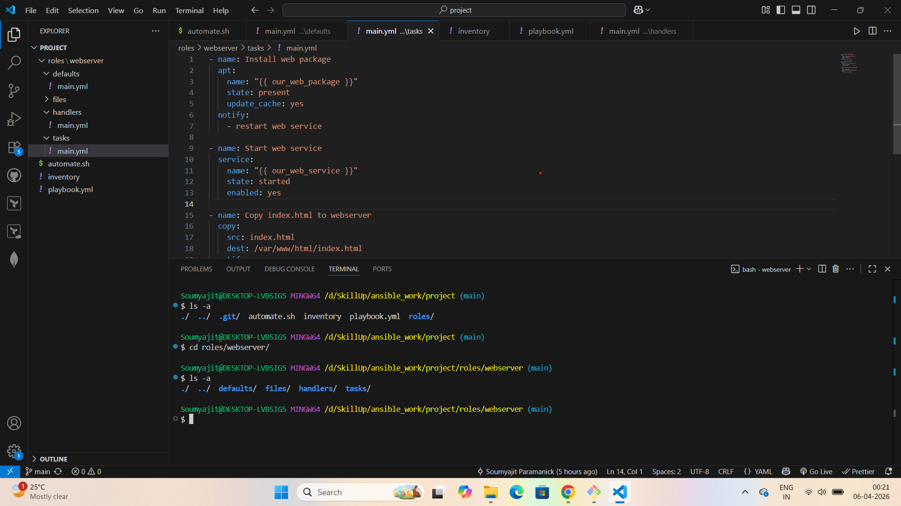
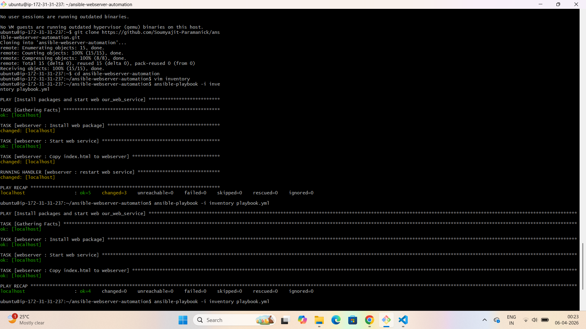
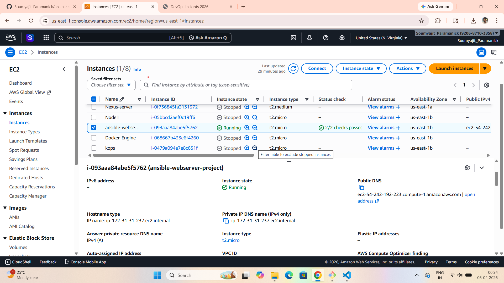
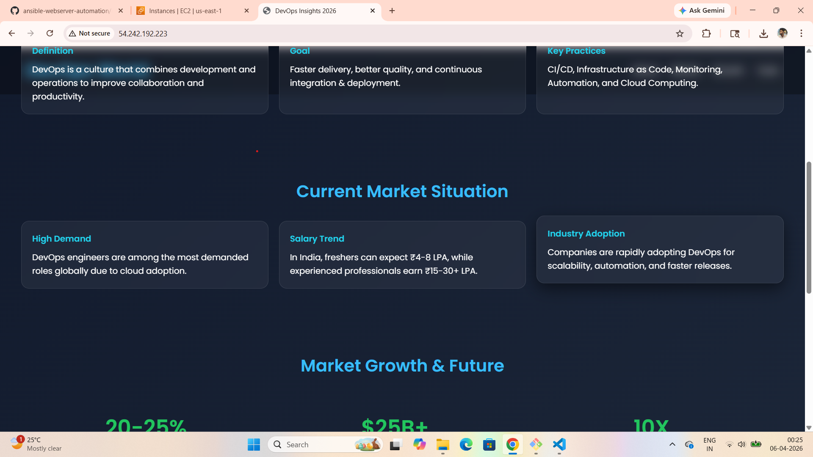

# 🚀 Ansible Web Server Automation on AWS

## 📌 Project Overview

This project demonstrates how to automate the deployment of a web server on an AWS EC2 instance using **Ansible**.

The automation includes:
- Installing Apache web server
- Deploying a static website
- Managing services using Ansible roles, variables, and handlers
- Ensuring idempotent configuration

---

## 🧰 Tech Stack

- **Cloud**: AWS EC2 (Ubuntu)
- **Automation Tool**: Ansible
- **Web Server**: Apache (apache2)
- **Version Control**: Git & GitHub

---

## 🏗️ Project Architecture

- Ansible runs on the control node (local machine or EC2)
- EC2 instance acts as managed node
- Role-based structure for scalable automation

---

## 📁 Project Structure
```bash
ansible-webserver-automation/
│── inventory
│── playbook.yml
│── roles/
│ └── webserver/
│ ├── tasks/
│ │ └── main.yml
│ ├── handlers/
│ │ └── main.yml
│ ├── defaults/
│ │ └── main.yml
│ ├── files/
│ │ └── index.html
```

---

## ⚙️ Ansible Concepts Used

- Inventory  
- Playbooks & Modules  
- Roles (industry-standard structure)  
- Variables & Defaults  
- Handlers & Notify  
- Idempotency  

---

## 🚀 Setup & Execution

### 1️⃣ Launch EC2 Instance
- OS: Ubuntu  
- Open ports:
  - 22 (SSH)
  - 80 (HTTP)

---

### 2️⃣ Connect to EC2
```bash
ssh -i <key.pem> ubuntu@<public-ip>
```

---

### 3️⃣ Install Ansible
```bash
sudo apt update
sudo apt install ansible -y
```

---

### 4️⃣ Clone Repository
```bash
git clone https://github.com/Soumyajit-Paramanick/ansible-webserver-automation.git

cd ansible-webserver-automation
```
---

### 5️⃣ Configure Inventory

```bash
[web]
localhost ansible_connection=local
```
---

### 6️⃣ Run Playbook
```bash
ansible-playbook -i inventory playbook.yml
```

---

## 🌐 Output

After successful execution, open:
```bash
http://<your-public-ip>
```

👉 You should see the deployed website.

---

## 📸 Screenshots

### 🖥️ VS Code Setup


### 💻 Git Bash Terminal


### ☁️ AWS EC2 Instance


### 🌐 Website Output


---

## 🔁 Idempotency Demonstration

- First run → Changes applied ✅  
- Second run → No changes (`changed=0`) ✅  

---

## 💡 Key Learnings

- Hands-on experience with Ansible roles  
- Automated deployment on AWS  
- Clean and scalable project structure  
- Understanding of idempotent automation  

---

## 👨‍💻 Author

**Soumyajit Paramanick**

- 🔗 GitHub: https://github.com/Soumyajit-Paramanick  
- 💼 Software Developer  
- 🚀 Practicing DevOps & Cloud through projects  

---

## 📢 Future Improvements

- Multi-node deployment  
- Nginx integration  
- CI/CD pipeline integration  
- Terraform + Ansible integration  

---

## ⭐ Support

If you found this helpful:
- ⭐ Star this repo  
- 🤝 Connect with me  
- 💬 Share feedback  